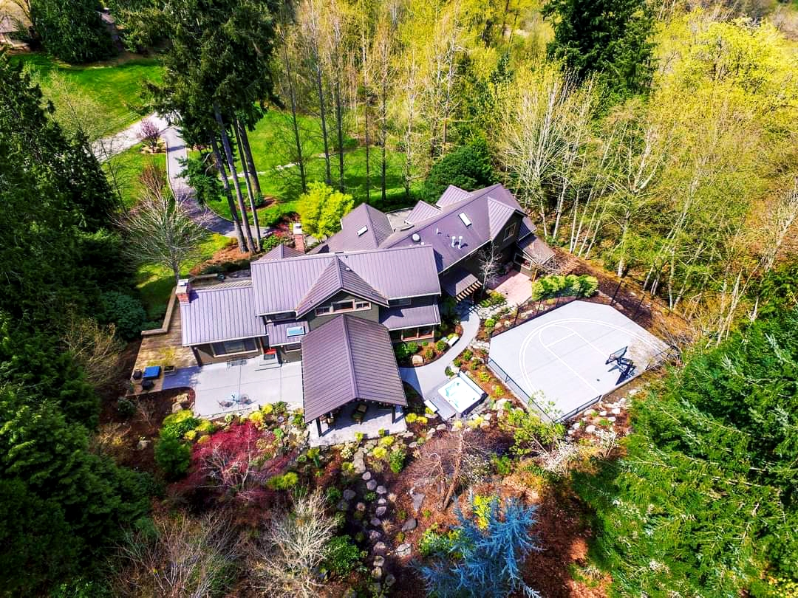
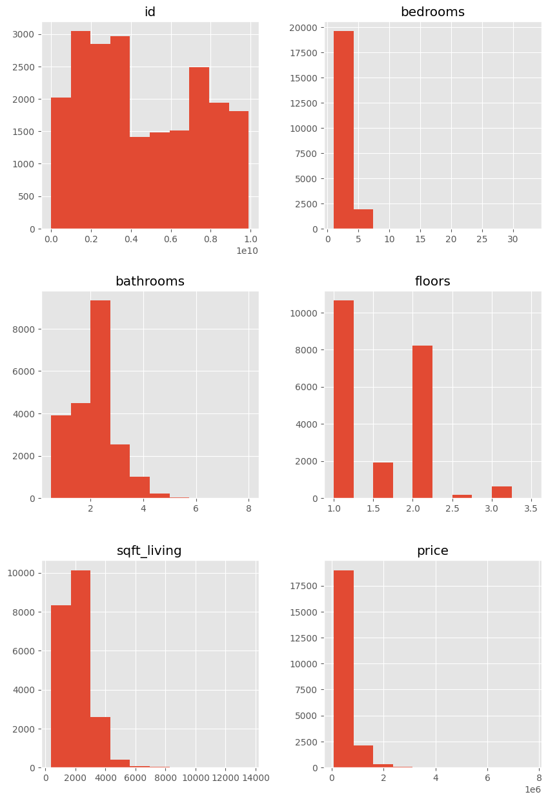
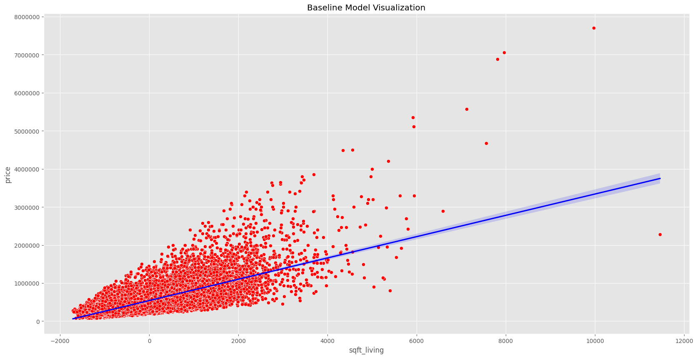
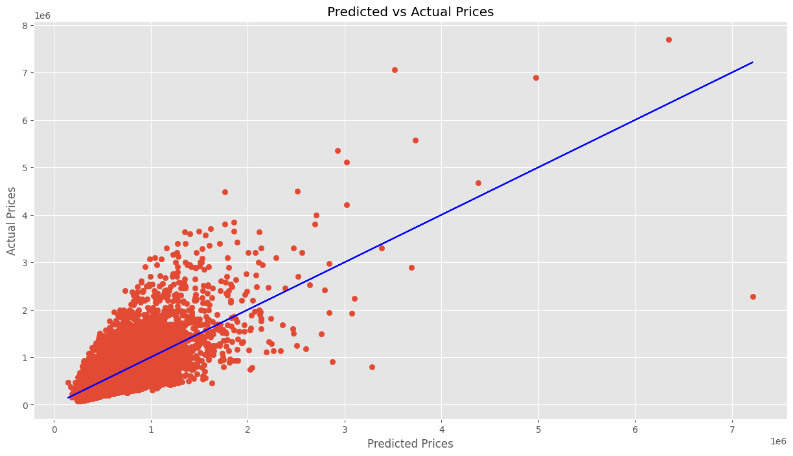

ANALYSIS OF KING COUNTY HOUSES

OVERVIEW

The king county house data analyses houses in order to make recommendations to a real estate agency. The data has information about fixed aspects of the houses that include the location, the year the house was built, and features that can be modified in the house. The various characteristics of the homes will determine various variables such as the house sqft, number of floors, and number of bathrooms used in the linear regression analysis to find the highest correlation of the features. From this data, we will be able to maximize the house's resale values.

BUSINESS PROBLEM

The real estate company is interested in doing renovations to improve the home values in King County. Hence to assist the King County real estate agency we will have to understand the market value of the local houses while comparing others in order to recommend profitable renovations to King County clients.

DATA UNDERSTANDING

The data provided  has different aspects of the homes. These comprise the year they were constructed, the cost of the home, and the number of bedrooms, bathrooms, and floors, among other essential details of the house such as the views.

DATA ANALYSIS AND MODELING

We will analyze the data using various variables because the purpose of this study is to find ways in which King County houses might be restored or upgraded in order to maximize the resale values.
The price will be the dependent variable while all the other features like bedrooms, bathrooms, sqft living, and floors will be the independent variables.

Baseline Model
          OLS Regression Results                            
==============================================================================
Dep. Variable:                  price   R-squared:                       0.492
Model:                            OLS   Adj. R-squared:                  0.492
Method:                 Least Squares   F-statistic:                 2.087e+04
Date:                Sat, 08 Jul 2023   Prob (F-statistic):               0.00
Time:                        22:41:42   Log-Likelihood:            -2.9912e+05
No. Observations:               21534   AIC:                         5.982e+05
Df Residuals:                   21532   BIC:                         5.983e+05
Df Model:                           1                                         
Covariance Type:            nonrobust                   
===============================================================================
                  coef    std err          t      P>|t|      [0.025      0.975]
-------------------------------------------------------------------------------
const        5.401e+05   1777.605    303.812      0.000    5.37e+05    5.44e+05
sqft_living   279.9321      1.938    144.473      0.000     276.134     283.730
==============================================================================
Omnibus:                    14582.265   Durbin-Watson:                   1.981
Prob(Omnibus):                  0.000   Jarque-Bera (JB):           516142.289
Skew:                           2.781   Prob(JB):                         0.00
Kurtosis:                      26.331   Cond. No.                         917.
==============================================================================

Notes:
[1] Standard Errors assume that the covariance matrix of the errors is correctly specified.

Baseline Model Interpretation and Visualization

 OLS regression results for the sqft living variable indicate that for each additional unit, the price is like to increase by $279.9321 in price.
The p values are statically significant with the coefficient estimate and intercept.

Multiple Linear Regression
LS Regression Results                            
==============================================================================
Dep. Variable:                  price   R-squared:                       0.507
Model:                            OLS   Adj. R-squared:                  0.507
Method:                 Least Squares   F-statistic:                     7368.
Date:                Sat, 08 Jul 2023   Prob (F-statistic):               0.00
Time:                        22:41:44   Log-Likelihood:            -2.9881e+05
No. Observations:               21534   AIC:                         5.976e+05
Df Residuals:                   21530   BIC:                         5.977e+05
Df Model:                           3                                         
Covariance Type:            nonrobust                                         
===============================================================================
                  coef    std err          t      P>|t|      [0.025      0.975]
-------------------------------------------------------------------------------
const        7.384e+05   8175.156     90.325      0.000    7.22e+05    7.54e+05
bedrooms    -5.851e+04   2342.906    -24.974      0.000   -6.31e+04   -5.39e+04
bathrooms    7418.4200   3516.259      2.110      0.035     526.291    1.43e+04
sqft_living   309.3849      3.096     99.945      0.000     303.317     315.452
===============================================================================
Omnibus:                    14184.293   Durbin-Watson:                   1.984
Prob(Omnibus):                  0.000   Jarque-Bera (JB):           464002.389
Skew:                           2.693   Prob(JB):                         0.00
Kurtosis:                      25.093   Cond. No.                     4.46e+03
==============================================================================

Notes:
[1] Standard Errors assume that the covariance matrix of the errors is correctly specified.
[2] The condition number is large, 4.46e+03. This might indicate that there are
strong multicollinearity or other numerical problems.

The model shows insights into the relationship between the number of bedrooms, bathrooms, and living square footage with the dependent variable price.

RECOMMENDATIONS

King County real estate agencies should consider maximizing their property values by including extra amenities such as having excellent house views.

Homeowners should also consider elevating their house values by improving amenities such as bathrooms and bedrooms. King County home sellers can use the regression models to determine a given property  compared to a given home. Improved amenities such as bathrooms and bedrooms have a great impact on the house value.

I would also advise King County real estate agency to advise homeowners in considering more square feet in their house when building or renovating.

The linear Regression indicates the impact on the house sale price by the homeowners doing renovations and the type of renovations that would boost the market of the homes.

NEXT STEPS

King County should consider looking at the most recent trends in the house market. Conducting a market research through media study on what is modern in order to gain different insights and maximize on the sale.

THANK YOU
For additional information on this project you can reach out to me through email brenda.mutai@student.moringaschool.com
